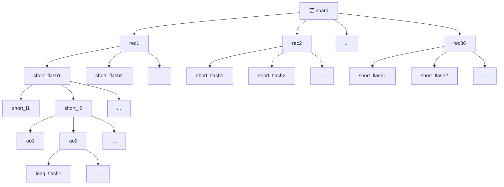

<v-click>

```php
$board = [
  0, 0, 0, 0, 1, 0, 1
  0, 0, 0, 0, 0, 0, 1
  1, 0, 0, 0, 0, 0, 0
  0, 0, 0, 0, 0, 0, 0
  0, 0, 0, 0, 0, 0, 0
  0, 0, 0, 0, 0, 0, 0
  0, 0, 0, 1, 1, 1, 1
];
```

</v-click>

<style>
    .shiki-container {
        position: absolute;
        top: 25%;
        left: 56%;
        margin-right: -40%;
        transform: translate(-50%, -50%);
    }
</style>

<arrow v-click x1="650" y1="170" x2="580" y2="90" color="#f00" width="1" arrowSize="1" />
<arrow v-click x1="545" y1="150" x2="495" y2="125" color="#f00" width="1" arrowSize="1" />

---


<p v-click class="absolute top-60 left-65 transform" style="font-size:100px;color:deeppink;">46!</p>


---



---
layout: section
---


::right::

- 递归和迭代
- 树和图的遍历 BFS & DFS
- 回溯和剪枝
- 贪心算法
- 岛屿问题

---
layout: fact
---


---
layout: default
---

# 递归 Recursion

- 你想知道递归是什么，你得先知道什么是递归.
- To understand recursion, you must understand recursion.
- 从前有座山，山上有座庙，庙里有个老和尚在给小和尚讲故事："从前有座山，山上有座庙，庙里有个老和尚在给小和尚讲故事：……"
- Bing = Bing is not google (Bing 不是谷歌)
- GNU = GNU's Not Unix (GNU 不是 Unix)
- PHP: Hypertext Preprocessor

<h2 v-click>这些都不是真正意义上的递归 !!!</h2>

---
layout: default
---

# 递归三要素

<br>

1. 确定递归函数的参数和返回值
2. 确定递归终止条件, 即函数 return 的出口
3. 确定单层递归的逻辑: 明确每次递归要进行什么操作


---
layout: default
---

# 递归: 1+2+3+...+100

## 迭代法

```php
$sum = 0;
for ($i = 1; $i <= 100; $i++) {
    $sum += $i;
}

return $sum;
```

## 递归法

```php {all|1,2|3-6|8,9|all}
// 1. 方法定义, 入参和出参
function sum(int $n): int {
    // 2. 递归终止条件
    if ($n === 1) {
        return 1;
    }

    // 3. 单层递归逻辑
    return sum($n - 1) + $n;
}
```

---
layout: default
---

# 递归: n 的阶乘

<br>
<br>

```php {all|1,2|3-6|8-9|all}
// 1. 方法定义, 入参和出参
function factorial(int $n): int {
    // 2. 递归终止条件
    if ($n === 1) {
        return $n;
    }

    // 3. 单层递归逻辑
    return $n * factorial($n - 1);
}
```

---

# 递归: 斐波那契数列的第 n 项

<br>
<br>

```php {all|1,2|3-6|8-9|all}
// 1. 方法定义, 入参和出参
function fib(int $n): int {
    // 2. 递归终止条件
    if ($n <= 2) {
        return 1;
    }

    // 3. 单层递归逻辑
    return fib($n - 1) + fib($n - 2);
}
```
